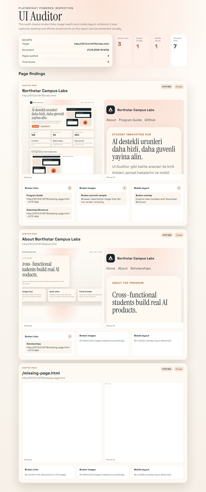

# UI Auditor with Playwright

Modern bir Playwright tabanli UI denetim araci. Bir siteyi desktop ve mobile gorunumde denetler, kirik linkleri ve gorselleri bulur, mobil layout sorunlarini isaretler ve sonucu gorsel bir HTML raporu olarak uretir.

## Ne Yapar?

- Hedef bir URL'den baslayip ayni origin altindaki sayfalari tarar
- Broken link kontrolu yapar
- Yuklenmeyen gorselleri tespit eder
- Mobile layout overlap ve overflow bulgulari cikarir
- Desktop ve iPhone screenshotlarini yan yana raporlar
- Access denied / anti-bot / loading state durumlarini ayri uyari olarak raporlar

## Hizli Baslangic

```bash
cd ui-auditor
npm install
npm run install:browsers
npm run audit:demo
```

Demo raporu:

- [HTML report](output/ui-auditor/demo-report/index.html)
- [JSON result](output/ui-auditor/demo-report/audit-result.json)
- [Preview image](output/ui-auditor/demo-report/report-preview.png)

Gercek bir siteyi denetlemek icin:

```bash
cd ui-auditor
npm run audit -- https://example.com
```

Varsayilan cikti klasoru:

```text
output/ui-auditor/latest/
```

## Proje Yapisi

```text
ui-auditor/
  demo-site/
  src/
    audit-site.mjs
    report-template.mjs
    run-demo-audit.mjs
    static-server.mjs
```

## Ekran Goruntusu



## Dokumantasyon

Daha detayli kullanim ve teknik notlar:

- [ui-auditor/README.md](ui-auditor/README.md)

## Lisans

Bu repo MIT lisansi ile paylasilmistir. Ayrinti icin [LICENSE](LICENSE) dosyasina bakin.
